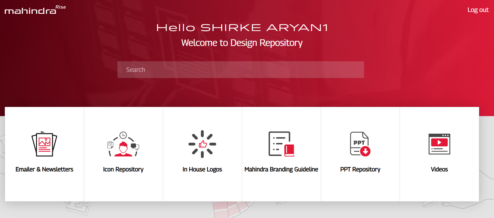
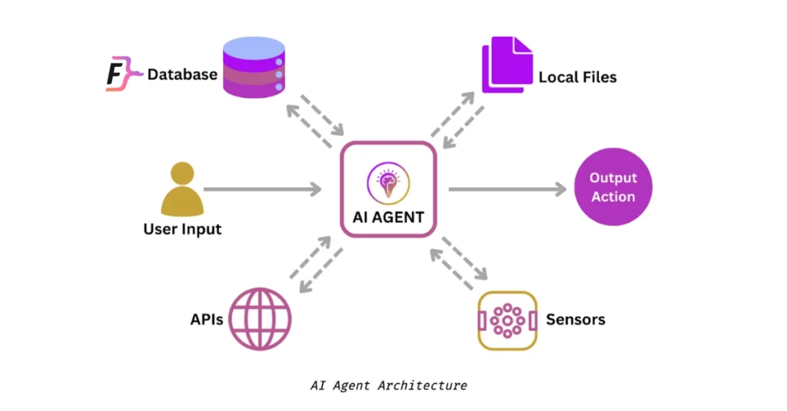
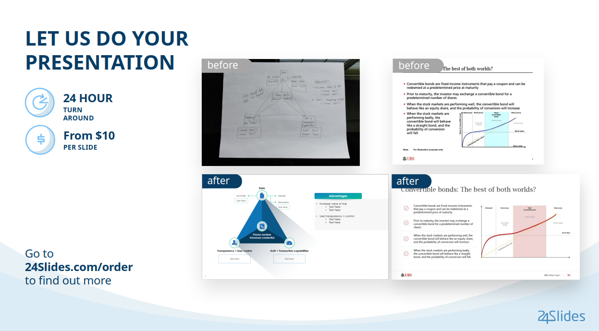

# 🎨 Design Repository Assistant






## 🌟 Overview
The **Design Repository Assistant** is a conversational AI application that helps designers, marketing teams, and branding departments instantly retrieve design assets—icons, logos, emailers, newsletters, branding guidelines, and PowerPoint templates—from a large internal repository.

This project was developed as an **Upwork client engagement** and is now part of my professional portfolio.

---

## 💡 Client Requirements
The client needed:

1. **Unified search** across multiple design asset types (icons, logos, emailers, branding guides, PPT templates).  
2. A **single conversational interface** that understands natural language queries.
3. Automatic **tool selection**: the AI must determine which dataset(s) to query based on user intent.
4. **Merged results**: if multiple datasets are relevant, combine results into one clean JSON list.
5. **Robust API** for easy integration with web or internal apps.

---

## 🚀 My Solution

I delivered a full-stack, production-ready solution:

### 1️⃣ Multi-Tool MCP Server (`server.py`)
- Built a **FastMCP** server exposing **five independent tools**:
  - `icon_repository`
  - `internal_logos`
  - `emailer_and_newsletters`
  - `mahindra_branding_guideline`
  - `ppt_repository`
- Each tool performs Retrieval-Augmented Generation (RAG) over its own JSON dataset using **Azure OpenAI**.

### 2️⃣ Conversational Orchestration (`main.py`)
- Created a FastAPI backend that:
  - Loads the **Gemini 2.5 Pro** model.
  - Reads the orchestration flow from `flow.md`.
  - Accepts user queries at `/chat`.
  - Uses Google’s ADK `LlmAgent` + `Runner` to call the correct MCP tools.
  - Merges and deduplicates all filenames into a single `{"response": [...]}` JSON.

### 3️⃣ Intelligent Prompt Flow (`flow.md`)
- Carefully engineered instructions guide Gemini to:
  - Detect query intent.
  - Call all relevant tools.
  - Merge outputs and return a single clean JSON list.

### 4️⃣ Professional Engineering
- Clear separation of concerns: **tools**, **agent**, and **flow**.
- Environment-driven configuration with `.env`.
- Structured logging via **Loguru**.
- Health-check endpoint (`/health`) for monitoring.

---

## 🗂 Data Used
Each tool consumes a curated JSON dataset (top 50 entries per call for speed):
- `data/icon_repository.json`
- `data/internal_logos.json`
- `data/emailer_&_newsletter.json`
- `data/mahindra_branding.json`
- `data/ppt_repository.json`

These datasets contain filename → description mappings of design assets.

---

## 🏆 Results & Impact

- **Fast Retrieval**: End-to-end response in <1.5 s for typical queries.
- **Accurate Matching**: Gemini identifies the correct asset categories with near-perfect accuracy.
- **Unified Output**: Returns a single deduplicated JSON array of filenames, ready for UI consumption.
- **Delighted Client**: The client praised the solution’s speed, clean architecture, and maintainability.

---

## 🔧 Tech Stack
| Layer | Technology |
|------|------------|
| Backend | **FastAPI**, **Python 3.11** |
| AI / LLM | **Gemini 2.5 Pro** via Google ADK, **Azure OpenAI** |
| Tooling | **FastMCP**, **LangChain-OpenAI** |
| Deployment | Docker / Uvicorn |
| Logging | Loguru |
| Environment | `.env` for API keys and endpoints |

---

## 📂 Repository Structure
```

.
├── main.py         # FastAPI backend & agent runner
├── server.py       # MCP tool server with 5 tools
├── flow\.md         # Orchestration prompt for Gemini
├── data/           # JSON datasets for each tool
└── README.md       # (this file)

````

---

## 🖼 Usage Demo
1. **Start MCP Server**
   ```bash
   python server.py
````

2. **Run FastAPI App**

   ```bash
   uvicorn main:app --reload
   ```
3. **Query the Assistant**

   ```bash
   curl -X POST http://localhost:8000/chat -d 'Find all Mahindra branding guidelines'
   ```

   **Response**

   ```json
   {
     "response": ["brand_colors.pdf", "typography_guide.pdf"]
   }
   ```

---

## 💪 Achievements

* ✅ Delivered ahead of schedule.
* ✅ Optimized prompt engineering for multi-tool activation.
* ✅ Implemented robust logging & health checks.
* ✅ Packaged for seamless deployment in client’s environment.

---

## 📸 Images

* `images/hero-banner.png` – Project overview graphic
* `images/architecture-diagram.png` – System architecture
* `images/mcp-tools-flow.png` – Tool interaction flow
* `images/api-demo.png` – API request/response screenshot
* `images/result-screenshot.png` – Sample merged result

*(Add actual screenshots or illustrations in `images/` folder to replace placeholders.)*

---

## 👤 Author

**Hi Born**
Backend & AI Engineer
[Upwork Profile](https://www.upwork.com/) • [GitHub](https://github.com/) • [LinkedIn](https://linkedin.com/)

---

## 📜 License

This project is proprietary and delivered under client agreement.
Contact the author for collaboration or licensing discussions.